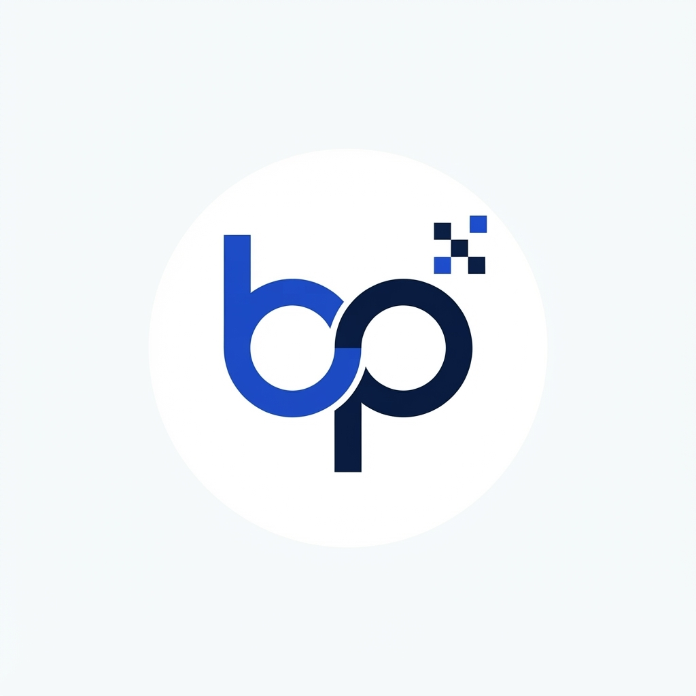

# Gym OS

<div align="center">



## A Beyond Pixels Product

**The complete gym management system built for Indian gyms.**

</div>

---

## What Is Gym OS?

Gym OS is a premium gym management platform by **Beyond Pixels** that combines a gym's website, member management, lead CRM, WhatsApp automation, class scheduling, trainer management, and AI-powered insights — all in one system.

### Live Links

- 🌐 **Gym OS Landing Page**: [https://somilsharma2000.github.io/gym-os/](https://somilsharma2000.github.io/gym-os/)
- 🏢 **Beyond Pixels (Parent Company)**: [https://somilsharma2000.github.io/beyond-pixels/](https://somilsharma2000.github.io/beyond-pixels/)
- 🤝 **Beyond Reach (Partner Portal)**: [https://beyondhub-bqxcyobv.manus.space](https://beyondhub-bqxcyobv.manus.space)

### The Beyond Pixels Ecosystem

```
Beyond Pixels (Parent Company)
├── Gym OS          → Product (gym management software)
├── Beyond Reach    → Partner platform (lead tracking & commissions)
└── Salon OS        → In development
└── Clinic OS       → In development
└── Restaurant OS   → In development
```

---

## What Makes This Different

Every gym software in India is either:
- A copied US product that doesn't understand Indian gyms (no offline mode, no Hindi, no festival logic, no UPI flow)
- A basic billing app that only does invoices and member entries

Gym OS is built ground-up for Indian gyms — Tier 1, 2, and 3 cities. It handles the full lifecycle: visitor → lead → trial → member → retention → renewal → referral → revenue.

## What's Inside

### For The Gym Owner
- **Website** — 9+ pages, auto-synced with Gym OS, mobile-first, SEO-optimized
- **Member Management** — digital profiles, QR check-in, plans, freezes, family accounts
- **Lead CRM** — 13 sources in one inbox (Instagram, Google, website, WhatsApp, walk-in, phone, referral, abandoned forms)
- **WhatsApp Automation** — 18 auto-triggers, 1/day cap, inbox, broadcasts
- **Payments** — owner-controlled, manual entry, no gateway, zero liability
- **Classes & Scheduling** — recurring classes, waitlist, capacity tracking
- **Trainer Management** — profiles, scheduling, commission, payroll
- **Diet & Workout Plans** — templates, auto-send, mandatory disclaimers
- **Progress Tracking** — measurements, charts, photos (permission-based)
- **AI Intelligence** — churn prediction, revenue forecast, daily action suggestions
- **Automation Engine** — 20 pre-built templates, no custom builder
- **Loyalty & Gamification** — points, streaks, challenges, badges
- **Expense & P&L** — categories, recurring, P&L statement, profit tracking

## Pricing

| Tier | Setup | Monthly | Target |
|------|-------|---------|--------|
| Standard | ₹15,000 | ₹5,000 | 100-200 member gyms |
| **Complete** ⭐ | ₹20,000 | ₹5,000 | 200-350 member gyms |
| Premium | ₹30,000 | ₹5,000 | 350+ member gyms |

---

## Repository Structure

```
gym-os/
├── README.md                         (this file)
├── index.html                        (live landing page — GitHub Pages)
├── logo.png                          (Beyond Pixels logo)
├── docs/
│   ├── FEATURE_SPEC.md               (300 features, 32 modules)
│   ├── ARCHITECTURE.md               (system design, DB schema, API routes)
│   ├── SAFETY_RULES.md               (48 removed features, safety rules)
│   ├── EDGE_CASES.md                 (82 edge cases, all fixed)
│   └── DEVELOPMENT_PHASES.md         (Phase 1/2/3, sprint plan)
└── calling-kit/
    ├── MASTER_SALES_PACKAGE.md       ← agents print this
    ├── AREA_RESEARCH_PROMPT.md       ← gym finder + budget estimation
    ├── COMPLETE_CALLING_BIBLE.md     (detailed reference)
    ├── PSYCHOLOGICAL_PRICING.md      (18 pricing techniques)
    ├── PERFECT_GYM_FINDER.md         (scoring system)
    └── COMPLETE_CALLING_KIT.md       (earlier version)
```

---

## License

© 2026 Beyond Pixels. All rights reserved.
